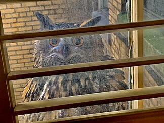
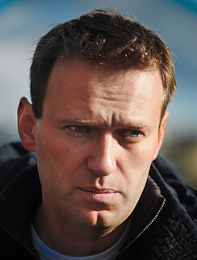
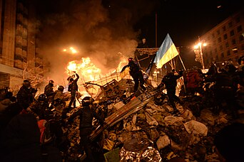

<!--This are links to the pages-->
     
 [Fact Finder](#home)
          
          
             
  [Welcome](file:///c:/temp/7bbddec2-de5a-438c-a9b0-f697e76df80e/index.html)
                  
            
  [Home]()
                
          
  [Random](file:///c:/temp/7bbddec2-de5a-438c-a9b0-f697e76df80e/Random%20Page/Random.html)
                
            
  [Settings](file:///c:/temp/7bbddec2-de5a-438c-a9b0-f697e76df80e/Settings%20Page/Settings.html)
                
            
       
      
<!--This is the markdown of the home page-->
  # Welcome 
  ## To
  #  <b>Fact Finder</b>
  <input type="search">
  [Add New Page](file:///c:/temp/7bbddec2-de5a-438c-a9b0-f697e76df80e/New%20page/new.html)
    
  
      
  ### From today's featured article      
  [<b>John Spencer</b>]() (1935-2006) was an English [snooker]() player. He  
 reached the final of the [English Amateur Championship]() three  
 years in a row, winning on his third attempt in 1966. After turning  
 professional in 1967, he won the [World Snooker Championship]()  
 as a debutant [in 1969]().  He won his second world title in the [1971 event](). 
His third, in 1977, made him the first player to win at  Sheffield's [Crucible Theatre]() where the event has been staged   
 annually ever since. His other notable victories include the 1975   
Masters, where he defeated Ray Reardon on a re-spotted black  
 in the deciding frame of the final, the 1978  Irish Masters, and  
 three editions of the BBCs Pot Black series. He was a snooker   
 commentator for  the BBC from 1978 to 1998, and served on   
the board of [the World Professional Billiards and Snooker]()  
 Association for 25 years, the last 7 of those as chair. 
 He retired from professional play in 1992 because of ill health,   
but continued to perform in [exhibition matches]() 
                          . The trophy for the   
Seniors Masters tournament was named in his memory in 2018.  
                           [Full article]()
                                                
               
            
   ### Did you Know            
...that having lived in Central Park for     
 more than a year after becoming   
 homeless, [Flaco]() (pictured) has been  
 accused of being a peeping tom?  
...that nine-year-old [Xiang Xuan]() was the youngest soldier to take part in the [Long March?]()  
...that because the [Cherokee]() people were deliberately routed through cholera-stricken areas, [their dislocation]() has been given as an example of [<b>Native American genocide in the United States?</b>]()   
...that [Centre College]() hosted two vicepresidential debates during [<b>John A. Roush's</b>]() presidency?  
 ...that former [<b>girl soldiers</b>]() may face higher rates of community rejection than former boy soldiers?  
 ...that Ireland's [2024 Eurovision]() entrant [<b>Bambie Thug</b>]() describes their musical genre as "Ouija pop"?  
 ...that [Campbell Soup]() considered suing Andy Warhol for his [Campbell's Soup]() Cans theme, but then promoted  
...that [<b>Ove Jørgensen</b>](), after giving his name to a [law of Homeric poetry](), renounced classical studies to write.
                   
   
  ### In the news      
..**Russian** opposition leader  
 [<b>Alexei Navalny</b>]() (pictured) [dies]() in   
 a [penal colony]() near [Kharp](), at   the age of 47.
...In [American football](), the [Kansas City Chiefs]() defeat the [San Francisco 49ers]()  to win [<b>the Super Bowl</b>]().
... In [association football, the Africa Cup of Nations]() concludes with [Ivory Coast]() defeating [Nigeria]() in [<b>the final</b>]().
...[Alexander Stubb is elected President of Finland]().
...[Marathon world]() record holder [<b>Kelvin Kiptum</b>]() dies in a car crash at the age of 24.
    
  **Ongoing**:
                  [Israel-Hamas war]() .
                   [Myanmar civil war]() .   [Red Sea crisis]()
                   [Russian invasion of Ukraine]()  
                   
                    
           
  ### On this day
  [<b>February 18</b>]() 
 ... [3102 BCE]() - According to   
 Hindu scriptures, [Kali   
Yuga]() , the last of the four  
 stages that the world  
 goes through as part of   
 the cycle of [Yugas](), began.  
...[1814 - War of the Sixth Coalition](): French troops   
 led by [Napoleon forced the Army of Bohemia]() to   
 retreat after it advanced dangerously close to   
 Paris.  
...[1977]() - The [Xinjiang 61st Regiment Farm fire]() started during [Chinese New Year]() when a firecracker ignited the wreaths of [late Mao Zedong](), killing 694 personnel.  
...[2014]() - [<b>A series of violent events</b>]() (pictured) involving protesters, riot police, and unknown shooters began in Kyiv that culminated in the ousting of Ukrainian president [Viktor Yanukovych]() five days later.  
  ###  Today's Featured Image
          
  
[<b>Echinaster sepositus</b>](), also known as the Mediterranean red   sea star, is a species of [starfish]() in the [Echinasteridae]() family.  
 It is found in the eastern Atlantic Ocean, including the   
Mediterranean Sea and the French side of the English Channel, at depths of up to 250 m (820 ft). It has a wide   
  range of habitats including rocky, sandy and muddy bottoms,  
 and sea-grass meadows formed of [Posidonia oceanica]() and   
 Zostera. E. sepositus has five relatively slender arms, with a   
diameter of up to 20 cm, or occasionally as much as 30 cm.  
It is a bright orange-red in colour with a soapy surface texture  
and a surface dotted with evenly spaced pits from which the   
animal can extend its deep red gills ([papula]()).
  This   
 E. sepositus individual was
                photographed in the Atlantic   
 Ocean in [Arråbida Natural Park](), Portugal.
         &#13;&#10;              
            

        

    

